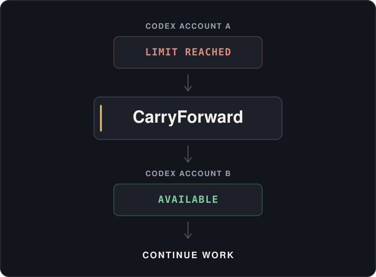
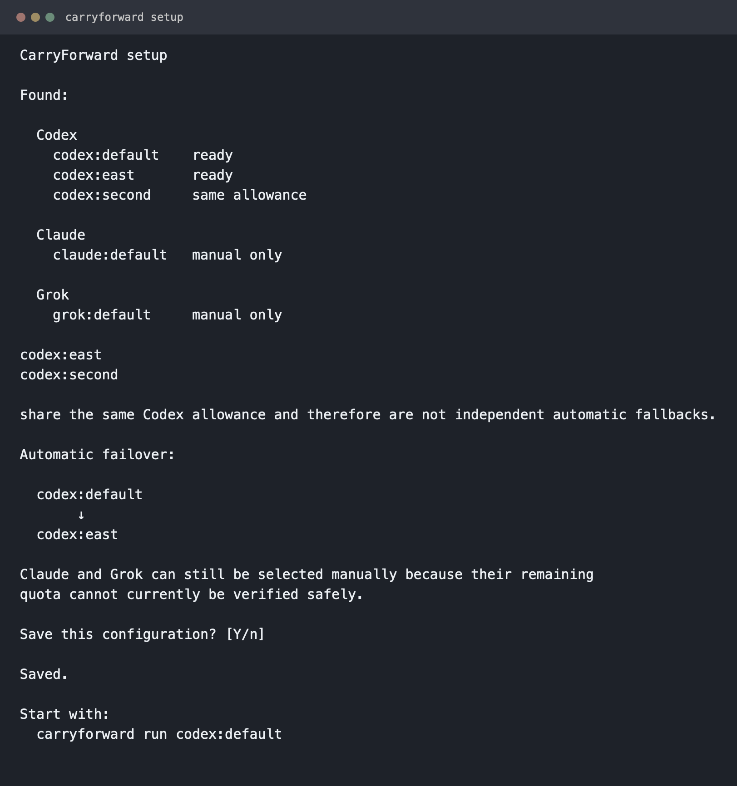
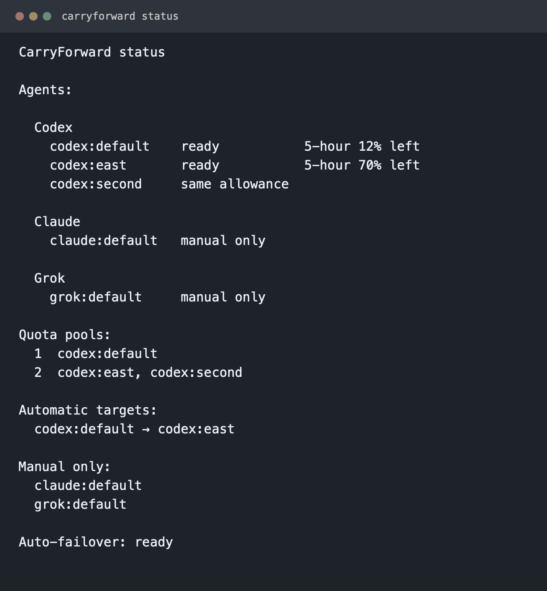
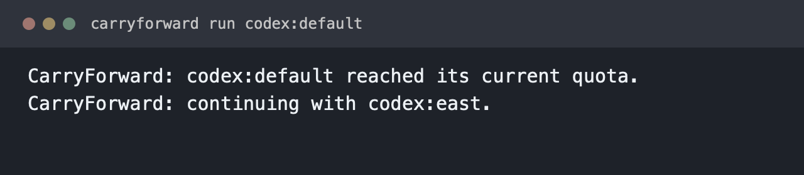
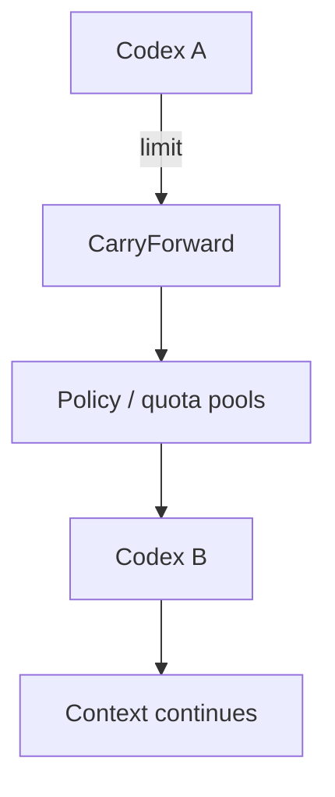

# CarryForward

Keep coding when your AI agent hits its limit.




CarryForward detects the AI coding agents and Codex accounts on this machine, learns which profiles share one quota, and carries the active session to another verified Codex account when the current one runs out.

<table>
<tr>
<td width="33%" valign="top">

**⚡ Automatic failover**<br>
Move to another verified Codex quota pool when the active account runs out.

</td>
<td width="33%" valign="top">

**🔄 Context handoff**<br>
Carry the active coding-session context forward without replaying the failed prompt.

</td>
<td width="33%" valign="top">

**🔒 Local-first**<br>
No telemetry, and account grouping does not read credential files.

</td>
</tr>
</table>

## See it in action

A short recording will live at `assets/demo/carryforward-demo.gif`. It has not been recorded yet.

<!-- assets/demo/carryforward-demo.gif is not in the repository yet. Do not link a missing image. -->

The 15-second shot list is in [assets/demo/README.md](assets/demo/README.md). Record it with a simulated quota event. Do not exhaust a real Codex account to make the demo.

## Quick start

macOS or Linux. Node.js 22.5 or newer.

```bash
git clone https://github.com/sergestack/carryforward.git
cd carryforward
./install.sh
carryforward setup
carryforward run codex:default
```

`./install.sh` links `~/.local/bin/carryforward` at this checkout. It does not need sudo and it does not download anything. If the bundled extractor is missing or does not match its pin, the installer stops and leaves any existing command link unchanged.

`carryforward setup` lists what it found and asks before saving a chain.

## Screenshots

Example profile names from the command output. Nothing here is a live account.

### Setup



### Status



### Failover



Recapture steps are in [assets/screenshots/README.md](assets/screenshots/README.md).

## How it works

CarryForward watches only the Codex process it started. When that session records `usage_limit_exceeded`, it plans the next verified pool, writes the prior context, stops that process, and opens the successor.



## Automatic failover

```bash
carryforward run codex:default
```

Profiles signed into the same Codex account share one allowance. Setup keeps one profile from each independent pool. It prefers the profile named `default`. Otherwise it uses the profile name that sorts first. The account id is not a sort key and is not written to disk. Answer `n` during setup to pick a different profile from a shared pool.

One Codex account is a supported setup. Automatic failover waits until a second independent Codex account exists. CarryForward does not put an agent whose quota it cannot verify on the automatic chain.

A direct `codex` launch is not supervised. `carryforward <target>` remains a manual handoff.

`carryforward run` with no saved chain stops and tells you to run `carryforward setup`. It does not invent a config file.

## Manual handoff

Claude and Grok can receive a session by name. Their remaining quota cannot currently be verified, so they are manual destinations.

```bash
carryforward claude:default
carryforward grok:default
```

## Supported agents

| Agent | Detect | Handoff | Live quota | Auto failover |
| --- | --- | --- | --- | --- |
| Codex | ✅ | ✅ | ✅ | ✅ |
| Claude | ✅ | ✅ | — | — |
| Grok | ✅ | ✅ | — | — |
| Gemini | ✅ | launch | — | — |
| OpenCode | ✅ | — | — | — |
| Copilot | ✅ | — | — | — |

Gemini can be launched when it is installed. It has no session source. OpenCode and Copilot are discovered only.

## Privacy

CarryForward does not send telemetry. It does not read credential files to group accounts. Codex quota comes from that profile's local app-server usage call. The account id stays in memory for the length of the command and is compared only with other Codex profiles. Config stores profile names:

```json
{
  "version": 1,
  "fallback": ["codex:default", "codex:second"]
}
```

The file is `$CARRYFORWARD_CONFIG_HOME/fallback.json` when that variable is set, otherwise `$XDG_CONFIG_HOME/carryforward/fallback.json`, otherwise `~/.config/carryforward/fallback.json`, mode `0600`. A malformed file or an unsupported `version` is left unchanged.

## Configuration

```bash
carryforward status
carryforward doctor
carryforward fallback
carryforward fallback set codex:default codex:second
carryforward next codex:default
```

`carryforward status` answers whether automatic failover is ready. `carryforward doctor` checks Node, this install, the bundled extractor, session directories, `lsof`, config, and live Codex usage. A missing optional agent is a warning. `carryforward next` plans the next verified profile and launches nothing.

## Platforms

macOS and Linux. Node.js 22.5 or newer. Automatic session binding uses `lsof` when it is on `PATH`. Without `lsof`, CarryForward will not guess among several new sessions.

## Limitations

- Automatic failover is Codex to Codex, and only for a process started with `carryforward run`.
- A second independent Codex account is required before a chain can be saved.
- If the active rollout cannot be identified uniquely, CarryForward leaves that session running.
- Claude and Grok have no safe live quota meter.
- `carryforward setup` does not create a chain unless you accept it.

## Uninstall

```bash
carryforward uninstall --dry-run
carryforward uninstall --yes
```

This removes CarryForward command links that point at this install, and the CarryForward cache. Codex, Claude, Grok, their configuration, sessions, and credentials stay. CarryForward's fallback file stays unless you pass `--delete-config --yes`.

## Vendored extractor

Context extraction comes from [cli-continues](https://github.com/yigitkonur/cli-continues) v4.1.1, MIT, Copyright (c) 2025-2026 Yigit Konur, pinned at `e486cd22a592d89d890cff056624647fbe9cbe80`. See `NOTICE.md` and `third_party/cli-continues/LICENSE`. CarryForward calls the library parsers only.

That commit's compiled runtime ships in this repository at `third_party/cli-continues`, with its MIT license and the production dependencies the parsers load. Installation does not fetch it. `CARRYFORWARD_VENDOR` can point at another checkout of that same pin.

## License

CarryForward is MIT licensed. See `LICENSE`.

Copyright (c) 2026 sergestack

`cli-continues` is a separate vendored MIT dependency. Its copyright and permission notice stay with that library.
